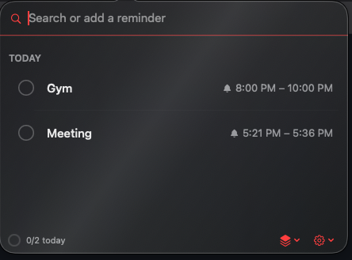
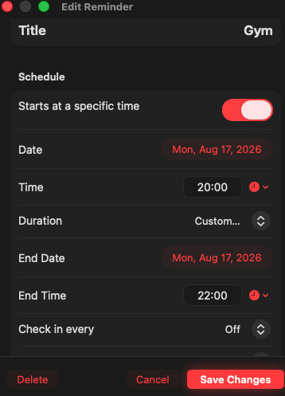
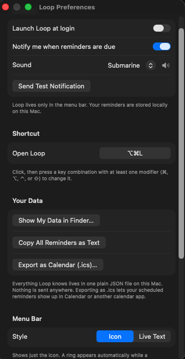

<p align="center">
  
</p>

<h1 align="center">Loop</h1>

<p align="center">
  A minimalist macOS menu bar reminders app.<br>
  No Dock icon. No network. No accounts. Just your tasks, stored locally.
</p>

<p align="center">
  
  
  
</p>

---

## Screenshots

<table>
  <tr>
    <td align="center"><b>Main Panel</b></td>
    <td align="center"><b>Edit Reminder</b></td>
    <td align="center"><b>Preferences</b></td>
  </tr>
  <tr>
    <td></td>
    <td></td>
    <td></td>
  </tr>
  <tr>
    <td>Search, add, complete. Grouped by Overdue, Today, Tomorrow, This Week, Later. Priority flags and filter chips.</td>
    <td>Full scheduling with date, time, duration, check-ins, and repeat options. Calendar popover for easy date picking.</td>
    <td>Notifications, sound picker, shortcut rebinding, accent colour, menu bar style, data export.</td>
  </tr>
</table>

---

## What It Does

Loop lives in your menu bar. Click the icon (or press **⌥⌘L**) to open it. Type a
sentence like `tomorrow at 3pm` or `friday eod at home` and press Return. Loop parses
the date, time, and tag, then saves your reminder.

When the time comes, you get a real macOS notification with **Mark Done** and
**Snooze 1 Hour** buttons. For longer tasks, Loop can check in with you every few
minutes to keep you on track.

Everything stays on your Mac as plain JSON files. No cloud. No accounts. No tracking.

---

## Features

### Capture

| | |
|---|---|
| **Natural language** | Type `tomorrow at 3pm`, `next friday eod`, `in 3 days at office` |
| **Templates** | Save any reminder as a template. Apply it in one click |
| **Quick add** | The search bar doubles as the add bar. Just type and press Return |

### Schedule

| | |
|---|---|
| **Time blocks** | Set a start time and optional end time (15m, 30m, 1h, 2h, or custom) |
| **Recurring** | Daily, Weekdays, or Weekly. Completing rolls it forward |
| **Check-ins** | Optional "Still on it?" notifications every 15, 30, 45, or 60 minutes |
| **24-hour time** | HH:mm input with a quick-pick menu of times near now |

### Organise

| | |
|---|---|
| **Sections** | Overdue / Today / Tomorrow / This Week / Later / Someday |
| **Priority** | None / Low / Medium / High with colour-coded flags |
| **Drag and drop** | Reorder within a section |
| **Filters** | Filter by tag, priority, or both (AND logic) |
| **Search** | Search everything, including completed items |

### Notifications

| | |
|---|---|
| **Mark Done** | Complete a reminder straight from the notification banner |
| **Snooze** | Push it back one hour |
| **Sounds** | Pick from 9 classic macOS alert sounds with a preview button |
| **Permission check** | If macOS is blocking notifications, Loop tells you and links to Settings |

### Menu Bar

| | |
|---|---|
| **Icon mode** | Progress ring while a scheduled block is running |
| **Live text mode** | Shows "Video Shooting . 45m left" or "AI Sec Prep . in 2h" |
| **Overdue alert** | Icon turns red when something is overdue |
| **Right-click** | Open / Preferences / Quit |

### Keyboard

| Key | Action |
|---|---|
| **↓ / ↑** | Move selection through the list |
| **Return** | Complete the selected reminder |
| **⌘Z** | Undo the last completion |
| **Esc** | Close the panel |

### Export

| Format | What |
|---|---|
| **Markdown** | Copy all reminders as a checklist to clipboard |
| **ICS** | Export scheduled reminders as a .ics calendar file |

---

## How It Works

```
+----------------------------------------------------------+
|                        macOS Menu Bar                     |
|                     [Loop icon / text]                    |
+----------------------------------------------------------+
         |  left-click          |  right-click
         v                      v
+-------------------+    +----------------+
|   Main Panel      |    |  Context Menu  |
|   (NSPopover)     |    |  Open          |
|                   |    |  Preferences   |
|  Search / Add     |    |  Quit          |
|  Reminder List    |    +----------------+
|  Filter Chips     |
|  Footer           |
+-------------------+
         |
         |  click "Edit" or right-click a row
         v
+-------------------+
|   Edit Window     |
|   (NSWindow)      |
|                   |
|  Title, Notes     |
|  Date, Time       |
|  Duration         |
|  Check-ins        |
|  Repeat           |
+-------------------+

Data flow:

  User types "tomorrow at 3pm"
         |
         v
  NaturalLanguageParser  ------>  ParsedInput { title, date, tag }
         |
         v
  TaskStore.add()  ------>  reminders.json  (local file)
         |
         v
  NotificationScheduler.sync()  ------>  UNUserNotificationCenter
```

---

## Architecture

```
Sources/
+-- LoopKit/                    Pure logic. No UI. Fully testable.
|   +-- Models/
|   |   +-- ReminderItem.swift      The core data model
|   |   +-- ReminderTemplate.swift  Reusable template model
|   +-- Store/
|   |   +-- TaskStore.swift         @Observable, JSON-backed
|   |   +-- TemplateStore.swift     @Observable, JSON-backed
|   +-- Utilities/
|       +-- NaturalLanguageParser   "tomorrow at 3pm" -> date + tag
|       +-- TimeOfDay               24-hour time parsing
|       +-- NotificationIdentifier  UUID + check-in suffix
|       +-- ICSExport               iCalendar file export
|       +-- MarkdownExport          Checklist export
|
+-- Loop/                       AppKit shell + SwiftUI views
    +-- App.swift                   AppDelegate, status item, popover, hotkey
    +-- Store/
    |   +-- NotificationScheduler   Reconciles notifications on every change
    |   +-- NotificationAuthorization
    |   +-- NotificationSoundOption
    |   +-- HotKeyRecorder
    |   +-- LaunchAtLogin
    |   +-- Date+Rounding
    +-- Views/
        +-- MenuBarContentView      Main popover UI
        +-- TaskRowView             Individual reminder row
        +-- EditTaskView            Edit window
        +-- PreferencesView         Preferences window
        +-- LiquidGlass             Translucent background with sheen
        +-- AccentColorOption       8-colour palette

Tests/
+-- LoopKitTests/               14 suites, 111 tests
```

**Key decisions:**

- All testable logic lives in `LoopKit` (pure Foundation, no UI). The `Loop` target
  is only AppKit and SwiftUI glue.
- `@Observable` with hand-rolled JSON instead of SwiftData (macros need full Xcode).
- No SwiftUI Scene. All windows managed by AppDelegate via AppKit directly.
- Notification scheduling uses a full reconciliation model on every data change.
  Simple and correct at personal scale.

---

## Requirements

| | |
|---|---|
| **macOS** | 14 (Sonoma) or later |
| **Swift** | 5.10+ |
| **Tools** | Command Line Tools or full Xcode |
| **Arch** | arm64 (Apple Silicon) |

---

## Getting Started

```bash
# Clone the repository
git clone <your-repo-url>
cd Loop

# Build
swift build

# Run tests (do not use bare "swift test", use this script)
./run_tests.sh

# Package the app
./build_app.sh

# Open it
open Loop.app
```

`run_tests.sh` is required because swift-testing needs explicit framework flags to
link when only Command Line Tools are installed (no full Xcode).

---

## Runtime Data

Loop stores everything in `~/Library/Application Support/Loop/`:

| File | Contents |
|---|---|
| `reminders.json` | All reminders |
| `templates.json` | Saved templates |

Nothing is sent anywhere. A corrupt file is backed up as
`reminders.corrupted-<timestamp>.json`, never silently deleted.

---

## Project Status

Loop is a working product in daily use. It is not a prototype.

**What works:** natural language input, scheduling, recurring reminders, check-in
notifications, priority, drag and drop, templates, search, keyboard navigation,
export, accent colours, launch at login.

**What is missing (ranked):**

1. No undo for deleting a reminder (highest value fix)
2. No undo for completing a recurring reminder
3. Snooze on a check-in moves the whole block
4. No keyboard route to the Edit window
5. No multi-select or batch actions
6. No import (export only)
7. No day-timeline view
8. No history or weekly review
9. No cross-device sync (needs iOS app and full Xcode)

See **[BACKLOG.md](BACKLOG.md)** for the full list and details.

---

## Documentation

| File | What |
|---|---|
| **[README.md](README.md)** | This file. Project overview |
| **[BACKLOG.md](BACKLOG.md)** | Environment, what is built, gaps, hard-won rules |
| **[HANDOFF.md](HANDOFF.md)** | AI handoff document. Current implementation state |

---

## License

Loop is a personal project. No license has been assigned yet.
