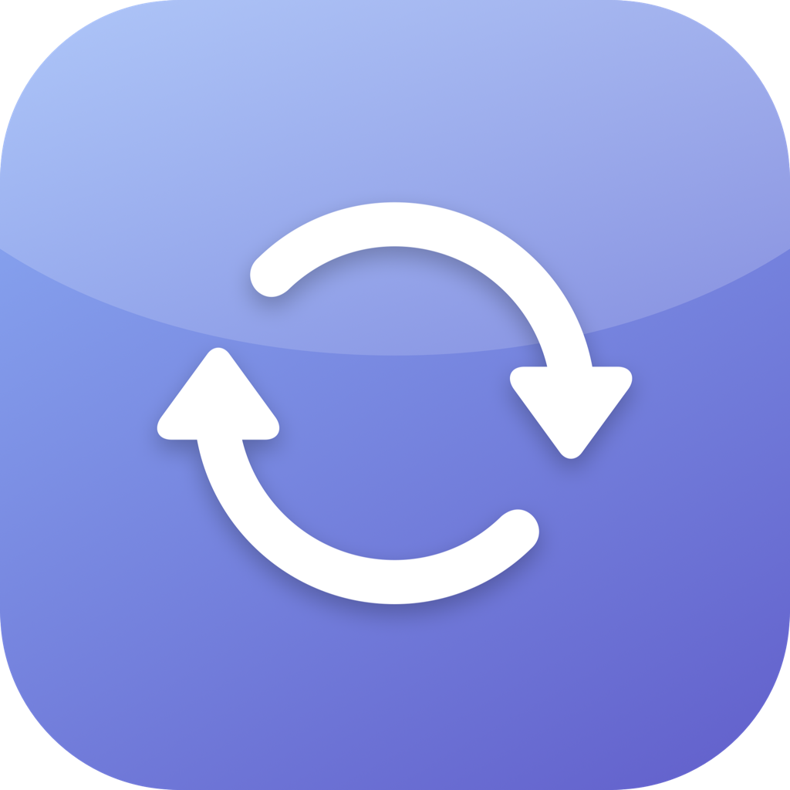
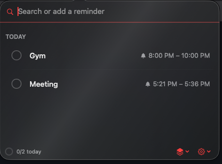
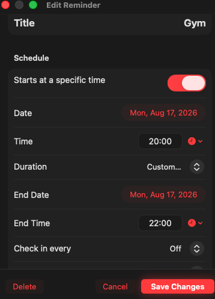
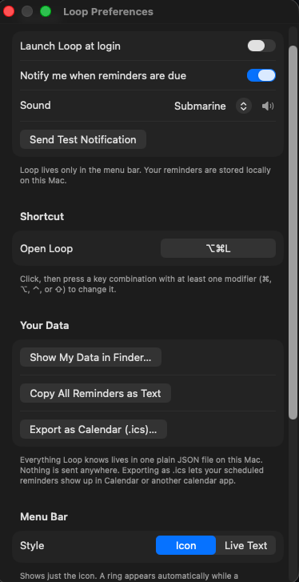

<p align="center">
  
</p>

<h1 align="center">Loop</h1>

<p align="center">
  A private macOS menu bar app for reminders and daily work logs.<br>
  No accounts. No network. Your data stays on your Mac.
</p>

<p align="center">
  
  
</p>

## Screenshots

<table>
  <tr>
    <td align="center"><b>Main Panel</b></td>
    <td align="center"><b>Edit Reminder</b></td>
    <td align="center"><b>Preferences</b></td>
  </tr>
  <tr>
    <td></td>
    <td></td>
    <td></td>
  </tr>
</table>

## What Loop does

- Create reminders with normal language, such as `tomorrow at 3pm`.
- Schedule tasks, time blocks, recurring reminders, and focus check-ins.
- Receive notifications with Mark Done and Snooze actions.
- Organize tasks with priorities, tags, search, filters, and templates.
- Keep a daily work log with optional prompts and a read-only end-of-day review.
- Choose separate sounds for reminders, check-ins, work-log prompts, and daily reviews.
- Read past work logs as Markdown files in the local `Work Logs` folder.
- Export reminders as Markdown or a calendar file.

## Install

Loop is built from source.

1. Install Xcode Command Line Tools:

   ```bash
   xcode-select --install
   ```

2. Clone and open the project:

   ```bash
   git clone https://github.com/recepbalibey/loop.git
   cd loop
   ```

3. Build and open the app:

   ```bash
   ./build_app.sh
   open Loop.app
   ```

Loop stores reminders and work logs locally in `~/Library/Application Support/Loop/`.

## Development

Run the test suite with:

```bash
./run_tests.sh
```
